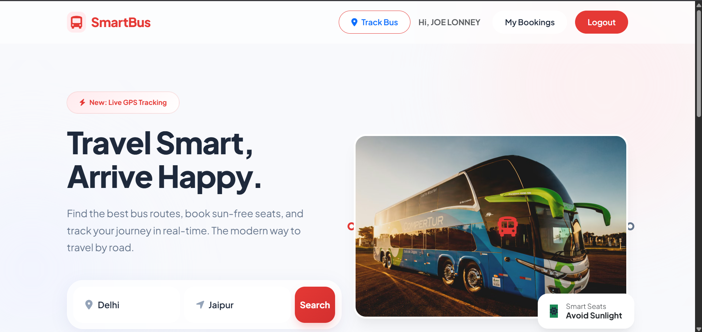
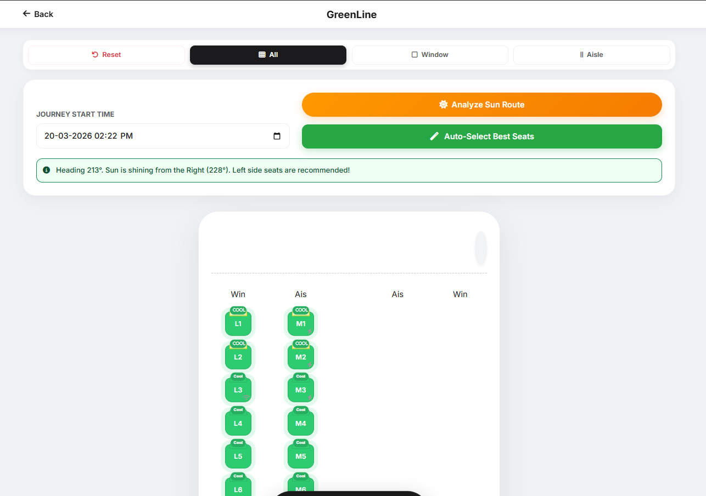
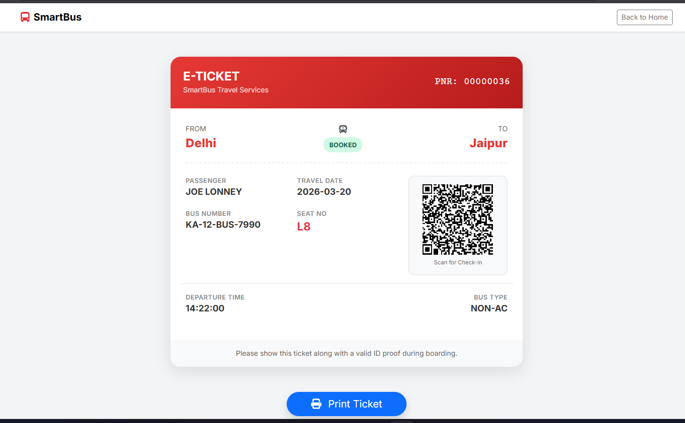
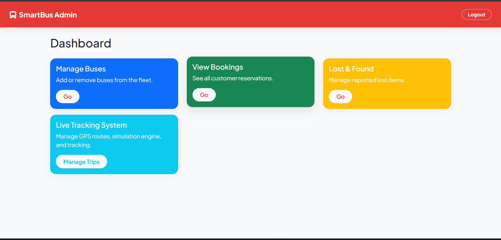
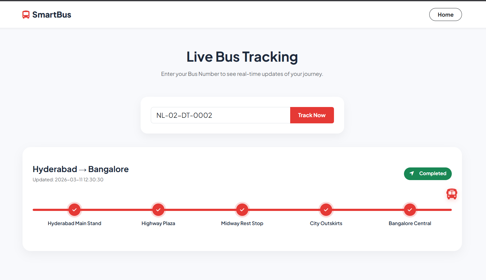

# 🚌 SmartBus - Web-Based Bus Ticket Booking System

<p align="center">
  
  
  
  
</p>

---

## 📖 About The Project

SmartBus is a modern, comprehensive web-based application designed to digitize and streamline the inter-city bus booking process. It goes beyond traditional booking platforms by integrating innovative features like **Smart Seat Selection** (which analyzes sun exposure during the journey) and real-time **GPS Tracking**. 

Whether you are a passenger looking for a comfortable, shaded seat or an administrator managing a fleet of buses and routes, SmartBus provides an intuitive and seamless experience.

---

## 🌟 Key Features

### 👤 User Module (Passenger)
*   **Smart Search:** Filter available buses by Source, Destination, and Travel Date.
*   **☀️ Sun Analysis Feature:** A unique, innovative feature that calculates the sun's position based on journey time and route to recommend "Shaded" vs. "Sunny" seats.
*   **Interactive Seat Layout:** Visual, real-time seat selection interface for both Sleeper and Seater buses.
*   **📍 Live Bus Tracking:** Integrated GPS tracking system (`track.php`) to view real-time bus locations.
*   **QR-Based E-Tickets:** Generates a downloadable, print-ready ticket with a QR code for easy boarding and check-in.
*   **My Bookings:** Dedicated dashboard for users to manage and review their booking history.
*   **Mobile-Responsive UI:** Built with Bootstrap 5, ensuring a flawless experience across desktop, tablet, and mobile devices.

### 🛠 Admin Module
*   **Dashboard:** Quick overview of fleet status, recent bookings, and revenue statistics.
*   **Fleet Management:** Add, edit, or remove buses from the system (AC, Non-AC, Sleeper).
*   **Route Management:** Define sources, destinations, and distances for the network.
*   **Booking Oversight:** View all passenger reservations and manage ticket statuses.

---

## 💻 Technology Stack

*   **Frontend:** HTML5, CSS3, JavaScript (ES6+), Bootstrap 5, FontAwesome
*   **Backend:** PHP (Procedural)
*   **Database:** MySQL
*   **Server:** Apache (via XAMPP/WAMP)
*   **Libraries:** 
    *   `suncalc.js` (For Sunlight Analysis)
    *   `qrcode.js` (For Ticket QR generation)

---

## 🚀 Quick Start (Windows)

The easiest way to get the project running on Windows:

1. **Database Setup:** Open phpMyAdmin and create an empty database named `bus_booking_system`.
2. **Run Server:** Double-click the `run_server.bat` file in the project root.
   * *This script will automatically populate the database, start the PHP development server, and open the application in your default browser.*

---

## ⚙️ Manual Installation & Setup Guide

If you prefer to set up the project manually in a traditional LAMP/XAMPP environment, follow these steps:

### Prerequisites
*   Install [XAMPP](https://www.apachefriends.org/index.html) (or WAMP/MAMP).
*   A modern web browser (Chrome, Firefox, Edge, etc.).

### Step 1: Configure Database
1. Open XAMPP Control Panel and start **Apache** and **MySQL**.
2. Go to `http://localhost/phpmyadmin` in your browser.
3. Click **New** and create a database named `bus_booking_system`.
4. Run the setup scripts via the browser (`setup_data.php`, `setup_gps_db.php`, `setup_admin.php`) to automatically create tables and seed dummy data, OR manually import your `.sql` files if provided in a database folder.

### Step 2: Setup Project Files
1. Copy the entire project folder.
2. Paste it into your XAMPP `htdocs` directory:
   * **Windows:** `C:\xampp\htdocs\smartbus`
   * **Mac:** `/Applications/XAMPP/htdocs/smartbus`

### Step 3: Configure Connection
1. Open `includes/db.php`.
2. Ensure the database credentials match your local MySQL setup (defaults shown below for XAMPP):
```php
<?php
$servername = "localhost";
$username = "root";
$password = ""; // Leave empty for standard XAMPP
$dbname = "bus_booking_system";
?>
```

### Step 4: Run the Application
*   **User Portal:** Open your browser and navigate to `http://localhost/smartbus/index.php`
*   **Admin Portal:** Login with Admin credentials at `http://localhost/smartbus/login.php`

---

## 🧪 Sample Login Credentials

Use these default credentials to test the system:

| Role | Email | Password |
| :--- | :--- | :--- |
| **Admin** | `admin@gmail.com` | `admin123` |
| **User** | `rahul@gmail.com` | `rahul123` |

---

## 📂 Project Structure

```text
/smartbus
│
├── /admin                # Admin Panel Files & Logic
├── /assets               # Static Assets (CSS, JS, Images)
├── /database             # SQL Files for Database Setup
├── /includes             # Shared PHP Files (db.php, header, footer)
│
├── index.php             # Landing Page & Main Entry Point
├── login.php             # Unified User/Admin Login
├── register.php          # User Registration
├── search.php            # Search Results Page
├── seats.php             # Interactive Seat Selection Interface
├── payment.php           # Payment Gateway Simulation
├── ticket.php            # Final QR Ticket Generation
├── track.php             # Live Bus Tracking Map
├── my_bookings.php       # User Booking History
├── run_server.bat        # Windows Quick-Start Script
└── README.md             # Project Documentation
```

---

## 📸 Screenshots

### 1. Home / Search Page


### 2. Smart Seat Selection (Sun Analysis)


### 3. Generated E-Ticket with QR Code


### 4. Admin Dashboard


### 5. Live Bus Tracking


---

## 📜 License

This project is developed for academic/demonstration purposes.